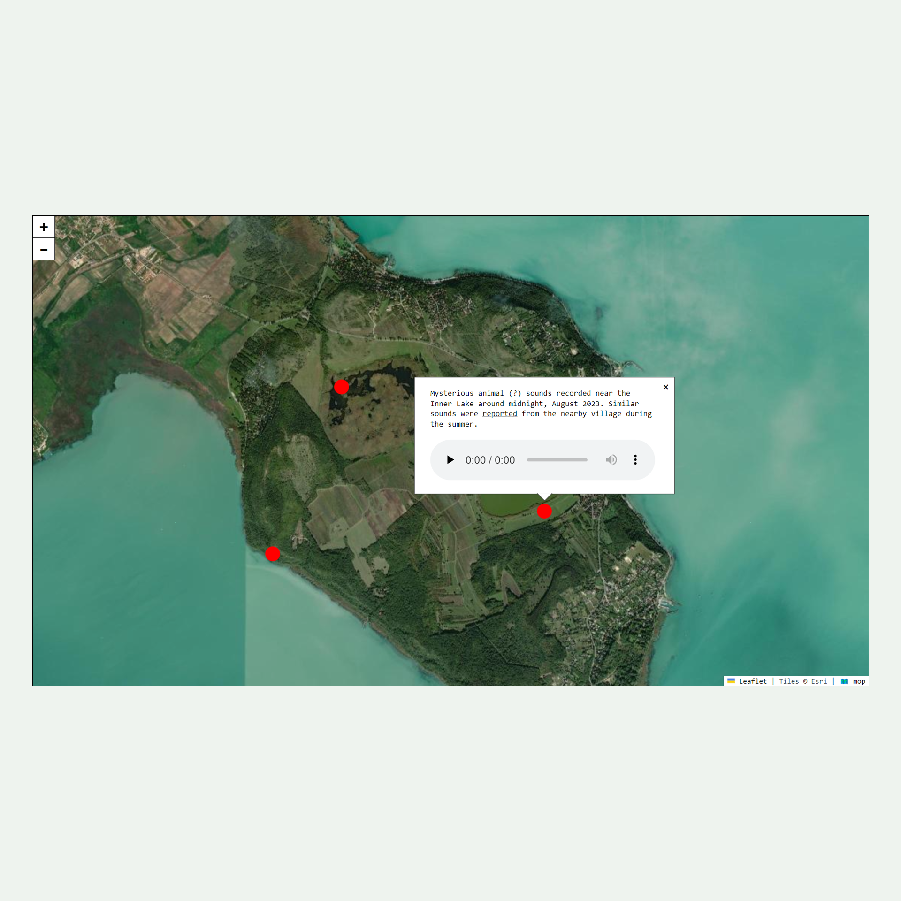

# 🗺️ mop

🗺️ mop is a low-effort kit for creating embeddable, interactive soundmaps without the need to code. It uses [Leaflet](https://leafletjs.com/) as an open source map and Google Sheets as a "database".

## Installation

### Locally

1. Clone this repository.
2. Run `npm ci`.
3. Run `npm start` to start a local server.
4. Do the configuration steps below.

### Glitch

1. Remix [this project](https://glitch.com/edit/#!/campnotes-mop).
2. Do the configuration steps below.

## Configuration

### Getting started

1. Copy [this sheet](https://docs.google.com/spreadsheets/d/1IdwTTG68o08BeoPjmV410-04hxljbD1R4wK8cybWmdY/edit#gid=0) to your own drive.
2. Make it publicly accessible and copy its link.
3. Paste its link into the main.js file (/assets/js/main.js) and check if the subsheet names match the ones in your sheet.
4. Time to add sounds to your map!

### Editing your map

- To add your sounds to the map, edit the "mop" section of the sheet.
- To change some things about the map itself, edit the "mop_options" section.
- For a tutorial on how to fill out your sheet, check the "help" section.

## Tools

- [Leaflet](https://leafletjs.com/)
- [public-google-sheets-parser](https://github.com/fureweb-com/public-google-sheets-parser)
- [markdown-it](https://github.com/markdown-it/markdown-it)
- [live-server](https://www.npmjs.com/package/live-server)
